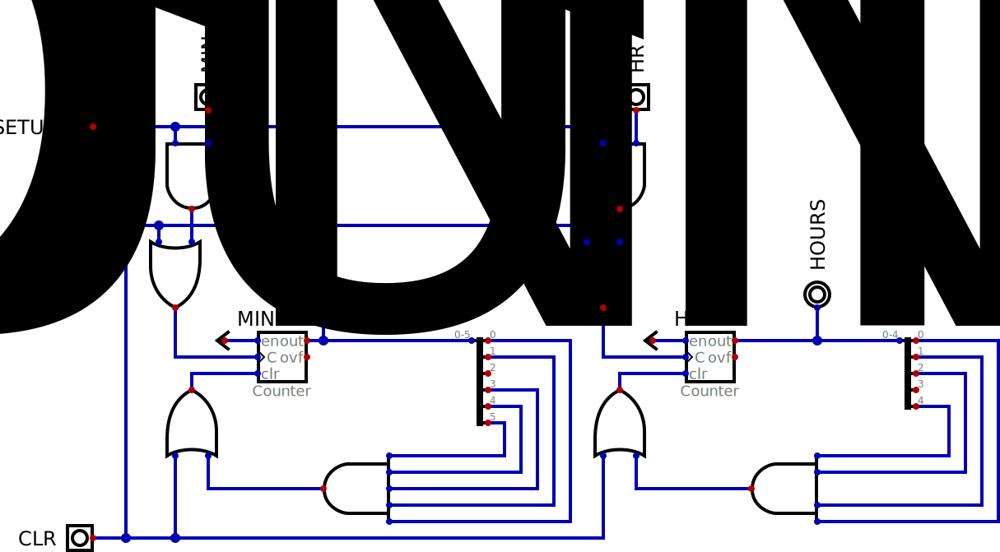

# Components Provided
{: .no_toc}

## Contents
{: .no_toc .text-delta}

1. TOC
{:toc}

---

{: .note}
Please pay attention to capitalization of pin names as they could be referencing different components.
If you have any doubts, please ask a question on Piazza.

## `BabylonianClock`

This component that your mentor has provided you satisfies the [flowchart](/docs/lab1/part1/the_clock#figure-1) from the [clock](/docs/lab1/part1/the_clock) stage of your circuit.

### Ports 

The ports of the module are provided below with a description:

| Port Direction | Port Name       | Active | Port Width (bits) | Description                                                             |
|:--------------:|-----------------|:------:|------------------:|-------------------------------------------------------------------------|
|      INPUT     | `CLK`           | Rising |                 1 | Clock input used for the alarm clock                                    |
|      INPUT     | `CLR`           |  High  |                 1 | Resets the alarm clock                                                  |
|      INPUT     | `SETUP`         |  High  |                 1 | Allows the user to set the time using `MIN_ADV` and `HR_ADV`            |
|      INPUT     | `MIN_ADV`       |  High  |                 1 | Increments the minute signal whenever either `SETUP` signals are active |
|      INPUT     | `HR_ADV`        |  High  |                 1 | Increments the hour signal whenever either `SETUP` signals are active   |
|     OUTPUT     | `SECONDS`       |    -   |                 6 | The current seconds the alarm clock has stored                          |
|     OUTPUT     | `MINUTES`       |    -   |                 6 | The current minutes the alarm clock has stored                          |
|     OUTPUT     | `HOURS`         |    -   |                 5 | The current hours the alarm clock has stored                            |

### Diagram

[//]: <> (Remember to make the background lightgrey by editing the SVG!)

### Explanation

The circuit above contains 3 counters, one for the seconds, minutes, and hours.
Each counter has additional reset logic attached to its output.
This is to ensure that the counter doesn't count past 59 (or 23 for hours).
These counters have **synchronous resets**, meaning that the counter is cleared **only when the clock rises and `clr` is set high**, not just when the `clr` pin is set high (which would be an asynchronous reset).
This is why we count from 0 to 59, as if we did 0 to 60 we would have effectively counted for 61 which can compound into temporal issues later down the line.

Let's focus on the reset logic for the `SECONDS_COUNTER`.
We `AND` together the 0th, 1st, 3rd, 4th, and 5th bits.
This means that the only time this reset signal could be 1 is when the counter is at `110111` (59) or `11111` (63).
Both of these values are &ge; 59, and hence we don't care whether the 2nd bit is a `1` or a `0`, so we are safe to exclude it from our `AND` gate.
We can observe a similar thought process for the `MINUTES_COUNTER` and `HOURS_COUNTER`.

Now let's take a closer look at the daisy chaining of the counters.
You may notice that the `CLK` input is not directly connected to the `MINUTES_COUNTER`, rather it is `AND`ed with the reset logic from the `SECONDS_COUNTER`.

{: .highlight-title}
> Lab Report
>
> **Question 1:** Why is the `CLK` input not directly connected to the `MINUTES_COUNTER`?

Now to the setup logic.
For the `SECONDS_COUNTER`, the `C` pin is calculated by `CLK AND (NOT SETUP_TIME)`.
This means that if `SETUP_TIME` is high, then no matter what the `CLK` is, the `SECONDS_COUNTER` will not advance (hence freezing up the rest of the system).
However, when `SETUP_TIME` is low, then the value of the `CLK` is passed to the `SECONDS_COUNTER`, making the system behave as normal.
The `SETUP_TIME` signal is used to pulse the `MINUTES_COUNTER` and `HOURS_COUNTER` in conjunction with their `_ADV` signals.

{: .highlight-title}
> Lab Report
>
> **Question 2:** Please describe in your words how the setup logic functions correctly.

## `BabylonianAlarm`

### Ports

The ports of the module are provided below with a description:

| Port Direction | Port Name       | Active | Port Width (bits) | Description                                                             |
|:--------------:|-----------------|:------:|------------------:|-------------------------------------------------------------------------|
|      INPUT     | `CLR`           |  High  |                 1 | Resets the alarm clock                                                  |
|      INPUT     | `SETUP`         |  High  |                 1 | Allows the user to set the time using `MIN_ADV` and `HR_ADV`            |
|      INPUT     | `MIN_ADV`       |  High  |                 1 | Increments the minute signal whenever either `SETUP` signals are active |
|      INPUT     | `HR_ADV`        |  High  |                 1 | Increments the hour signal whenever either `SETUP` signals are active   |
|     OUTPUT     | `MINUTES`       |    -   |                 6 | The current minutes the alarm clock has stored                          |
|     OUTPUT     | `HOURS`         |    -   |                 5 | The current hours the alarm clock has stored                            |

### Diagram

### Explanation

The logic for the alarm is very similar to the clock.
There is however, a couple noteworthy differences.

{: .highlight-title}
> Lab Report
>
> **Question 3:** Please identify the differences and reason as to why the differences are there in the context of this lab.
> There are 3 major differences we would like you to touch up on.

## `SevenSegmentDecoder`

Please interface your clock values with this decoder to generate accurate signals for the TickTok Display Division to use in the final product.

### Ports

The ports of the module are provided below with a description:

| Port Direction | Port Name       | Active | Port Width (bits) | Description                                                             |
|:--------------:|-----------------|:------:|------------------:|-------------------------------------------------------------------------|
|      INPUT     | `DATA_IN`       |   -    |                 7 | 7-bit unsigned integer number to get decoded into 2 digits              |
|     OUTPUT     | `DATA_OUT`      |   -    |                14 | Signals 0-7 are for the first display, and 8-14 are for the second      |
