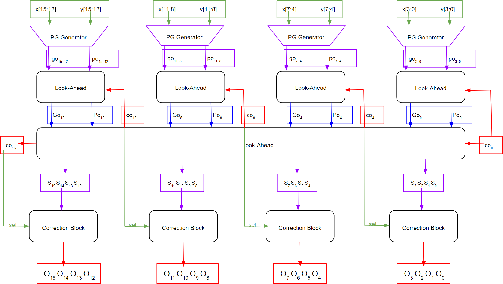

# 4-Digit 2421 Carry Look-Ahead Adder
{: .no_toc}

## Contents
{: .no_toc .text-delta}

1. TOC
{:toc}

---

## Creating a 4-Digit 2421 CLA

As most of you will remember from our discussions in CSE140, 2421 is a non-weighted code to represent decimal numbers.
It is similar to BCD, but differs in that each digit embeds a bias of +6 in its representation.
It turns out that adding a bias of +6 introduces a number of useful features.
For instance, it is possible to take the 9's complement of an 2421 digit by simply inverting the bits in its representation.
Secondly, it makes the addition of multiple digit numbers much easier.
When two 2421 digits are added, the correction step consists of either adding or subtracting 6.
In Lab 3, you have implemented this correction logic that you will reuse for this lab.
We encourage you to verify the stated 2421 properties by perusing this table.

### Table 1

{: .text-delta}
Decimal, BCD, and 2421 number representations

| **Decimal value** | **BCD Code** | **2421 Code** |
|:-----------------:|:-------------:|:-------------:|
| 0                 | 0000          | 0000          |
| 1                 | 0001          | 0001          |
| 2                 | 0010          | 0010          |
| 3                 | 0011          | 0011          |
| 4                 | 0100          | 0100          |
| 5                 | 0101          | 1011          |
| 6                 | 0110          | 1100          |
| 7                 | 0111          | 1101          |
| 8                 | 1000          | 1110          |
| 9                 | 1001          | 1111          |

To handle this constant 6 correction, you will be using a ***Correction*** block as shown in [Figure 5](#figure-5).
The correction block takes the 4-bit sum generated by the 16-Bit Complemented carry adder and the `sel` signal as inputs and generates the corrected output.
If sel is '1' then the output generated by the Correction Block is '6' (0110) subtracted from the input, and if sel is '0' then the output generated by the Correction Block is '6' (0110) added to the input.

### Figure 5

{: .text-delta}
Correction Block

You need to integrate the Correction Block with the Single-Level 16-bit Complemented CLA binary adder by taking in the corresponding complementary carry bit as the sel signal input and perform correction as shown in [Figure 6](#figure-6).

### Figure 6

{: .text-delta}
Integration of Correction Block with Single-Level 16-Bit Alternative CLA Adder

The same needs to be done with the Two-Level 16-bit Complemented CLA binary adder as shown in [Figure 7](#figure-7).

### Figure 7

{: .text-delta}
Integration of Correction Block with Two-Level 16-Bit Alternative CLA Adder

## Implementation Guidelines

You are asked to implement both the single-level and two-level 16-bit CLA 2421 look-ahead adders.
Once you have finished both implementations, you are asked to furthermore compare their performance.

You can read the total delay of the circuit by using the waveform and setting the `Show single gate steps` option and count the cycles between your signal change and the output changing.
When you change the inputs, it will take some time for the effect of that change to reflect into the output.
This difference in time is your total delay.
Usually different input-output pairs have distinct delays.
Even for the same input-output pair, its delay varies with distinct input combinations.
The maximum delay value of each input-output pair is considered as its real delay value.

To understand the timing behavior of these two circuits (single and two-level 4-digit 2421 CLA adders) better, we will start by analyzing the paths in the small components that we have created; then we will look into timing paths in the entire 2421 adder designs.
First, let us try to find the maximum delays in the 4-bit CLA adder.
We provide you with the test vectors you need to use for each column in Table 2.
What is unique about these test vectors? Does any other test vector work to test the maximum delays in these paths? Please fill in Table 2 with your measured results.
Are they consistent with your expectations?

### Path Delay of 4-bit CLA Binary Adder

#### Test Vector 1

$X$: `1000`

$Y$: `0111`

$C_0$: `0` → `1`

| **Path**         | **Delay**     |
|:----------------:|:-------------:|
| $c_0$ to $c_1$   |   10          |
| $c_0$ to $c_2$   |               |
| $c_0$ to $c_3$   |               |
| $c_0$ to $c_4$   |               |

#### Test Vector 2

$X$: `1000` → `1001`

$Y$: `0111`

$C_0$: `0`

| **Path**         | **Delay**     |
|:----------------:|:-------------:|
| $x_0$ to $c_1$   |   17          |
| $x_0$ to $c_2$   |               |
| $x_0$ to $c_3$   |               |
| $x_0$ to $c_4$   |               |

### Path Delay of 16-bit CLA Binary Adder

#### Test Vector 1

$X$: `1000100010001000`

$Y$: `0111011101110111`

$C_0$: `0` → `1`

| **Path**           | **Delay (Single-Level)**     | **Delay (Two-Level)**        |
|:------------------:|:----------------------------:|:----------------------------:|
| $c_0$ to $c_4$     |   10                         |   10                         |
| $c_0$ to $c_8$     |                              |                              |
| $c_0$ to $c_{12}$  |                              |                              |
| $c_0$ to $c_{16}$  |                              |                              |
| $c_0$ to $s^+_3$   |                              |                              |
| $c_0$ to $s^+_7$   |                              |                              |
| $c_0$ to $s^+_{11}$|                              |                              |
| $c_0$ to $s^+_{15}$|                              |                              |

$s^+_i$ is the delay to sum bits at the binary adder output (without the correction step)

#### Test Vector 2

$X$: `1000100010001000` → `1000100010001001`

$Y$: `0111011101110111`

$C_0$: `0`

| **Path**           | **Delay (Single-Level)**     | **Delay (Two-Level)**        |
|:------------------:|:----------------------------:|:----------------------------:|
| $x_0$ to $c_4$     |   24                         |   24                         |
| $x_0$ to $c_8$     |                              |                              |
| $x_0$ to $c_{12}$  |                              |                              |
| $x_0$ to $c_{16}$  |                              |                              |
| $x_0$ to $s^+_3$   |                              |                              |
| $x_0$ to $s^+_7$   |                              |                              |
| $x_0$ to $s^+_{11}$|                              |                              |
| $x_0$ to $s^+_{15}$|                              |                              |

$s^+_i$ is the delay to sum bits at the binary adder output (without the correction step)
