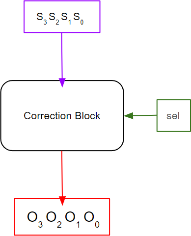

# 4-Digit 2421 Carry Look-Ahead Adder
{: .no_toc}

## Contents
{: .no_toc .text-delta}

1. TOC
{:toc}

---

## Creating a 4-Digit 2421 CLA

As most of you will remember from our discussions in CSE140, 2421 is a non-weighted code to represent decimal numbers.
It is similar to BCD, but differs in that each digit embeds a bias of +6 in its representation.
It turns out that adding a bias of +6 introduces a number of useful features.
For instance, it is possible to take the 9's complement of an 2421 digit by simply inverting the bits in its representation.
Secondly, it makes the addition of multiple digit numbers much easier.
When two 2421 digits are added, the correction step consists of either adding or subtracting 6.
In Lab 3, you have implemented this correction logic that you will reuse for this lab.
We encourage you to verify the stated 2421 properties by perusing this table.

### Table 1

{: .text-delta}
Decimal, BCD, and 2421 number representations

| **Decimal value** | **BCD Code** | **2421 Code** |
|:-----------------:|:-------------:|:-------------:|
| 0                 | 0000          | 0000          |
| 1                 | 0001          | 0001          |
| 2                 | 0010          | 0010          |
| 3                 | 0011          | 0011          |
| 4                 | 0100          | 0100          |
| 5                 | 0101          | 1011          |
| 6                 | 0110          | 1100          |
| 7                 | 0111          | 1101          |
| 8                 | 1000          | 1110          |
| 9                 | 1001          | 1111          |

To handle this constant 6 correction, you will be using a ***Correction*** block as shown in [Figure 5](#figure-5).
The correction block takes the 4-bit sum generated by the 16-Bit Complemented carry adder and the `sel` signal as inputs and generates the corrected output.
If sel is '1' then the output generated by the Correction Block is '6' (0110) subtracted from the input, and if sel is '0' then the output generated by the Correction Block is '6' (0110) added to the input.

### Figure 5

{: .text-delta}
Correction Block

You need to integrate the Correction Block with the Single-Level 16-bit Complemented CLA binary adder by taking in the corresponding complementary carry bit as the sel signal input and perform correction as shown in [Figure 6](#figure-6).

### Figure 6

{: .text-delta}
Integration of Correction Block with Single-Level 16-Bit Alternative CLA Adder

The same needs to be done with the Two-Level 16-bit Complemented CLA binary adder as shown in [Figure 7](#figure-7).

### Figure 7

{: .text-delta}
Integration of Correction Block with Two-Level 16-Bit Alternative CLA Adder

