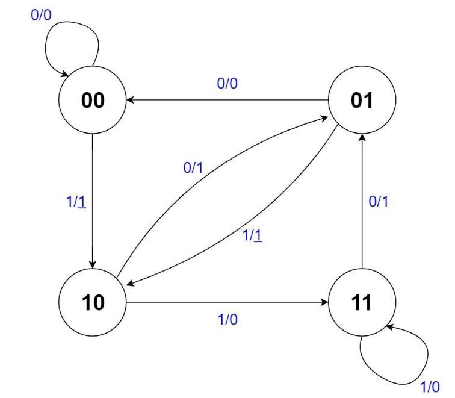

# Mealy Implementation of Booth's Controller
{: .no_toc}

## Contents
{: .no_toc .text-delta}

1. TOC
{:toc}

---

## Mealy Implementation

When performing Booth's multiplication, we scan the multiplier from right to left by examining two bits in every step.
Therefore, there are a total of 4 possible patterns in the bits we are examining, each of which corresponds to an arithmetic operation (addition, subtraction, or no-op) specified by the Booth's table.
From a sequential circuit design perspective, we can also view these four patterns as four different states of an FSM.
The transition from one state to another state will be triggered by the right shifting of the multiplier, as the new bit that is shifted into the two-bit window changes the bit pattern that is under examination.
The arithmetic operation that needs to be performed in each step can just be **determined by the current state and the new bit that is shifted in**.
Based on these concepts a four state Mealy FSM for Booth's algorithm can be constructed as in [Figure 2.1](#figure-2.1).

### Figure 2.1

{: .text-delta}
Four state Mealy FSM for Booth's Multiplication

{: .note}
Treat the $\underline{1}$ in this diagram as $\overline{1}$ like we had for Lab 2.

As you can see, each edge is annotated with a pair of values separated by a slash("/").
The left symbol on an edge denotes the input value of the FSM.
The value after the slash is the output value, where a $1$ indicates an addition, a $\underline{1}$ indicates a subtraction, and a $0$ indicates a no-op.
You may wonder how a single state can have two different outputs for the same 2-bit pattern in Booth's algorithm.
For example, we have usually associated 00 with a no-op, according to Booth's algorithm as we saw it in Lab 2, but here the output of the 00 state can be either a 0 or a $\underline{1}$ (either a no-op or a subtraction).
The puzzle can be resolved by realizing that the pattern associated with each state in the Mealy machine represents the *previous* pattern held in the 2-bit window under examination in Booth's, and the input to the FSM is the bit that was newly shifted into the 2-bit window (that is, the FSM input is the current least significant bit of the multiplier).
Since the previous value of the 2-bit window is remembered by the current state, we no longer need the extra flip-flop after the least significant bit of the multiplier to hold the last value shifted out of the multiplier in our Booth's circuit from Lab 2.
An additional benefit of this representation is that since the state is associated with the previous value, the Mealy machine can be directly initialized to state 00 (even if the LSB of the original multiplier is 1).

As you might have already noticed, the four-state FSM above can be optimized as some states within this diagram are equivalent.
The current diagram requires 2 flip-flops to maintain the current state.
But, after performing state minimization, you will be able to reduce the number of states to just 2!
The state machine must also have a 2-bit output, as there are three possible outputs (add, subtract, or no-op).

So now we have a Mealy machine that can specify which operation to perform.
The next question is how we can use this new FSM to control the whole circuit and skip operations.
As you recall, the Lab 2 implementation contained a separate `Controller` component that controlled whether to shift or perform an add/subtract operation.
Besides the `INIT` and `END` phases, the controller simply ticked back and forth between add/subtract and shift phases.
Our current Mealy machine outputs whether to add, subtract, or no-op (do nothing) during an add/subtract phase.
First, we can have the Mealy machine make a state transition according to the clock signal, instead of whenever a shift is performed.
Then, if we plan to skip the add/subtract phase whenever the Mealy machine outputs a 0 (a no-op), we can instead have that output specify to perform a shift operation, effectively skipping the no-op.
If the Mealy machine outputs a $1$ or a $\overline{1}$, then the circuit will use that as the control signal to enter the add/subtract phase, as well as whether the multiplicand should be added or subtracted.

We are well on our way to getting a properly functioning controller.
The only problem is that we must also perform a shift after every add or subtract operation, which we cannot perform at the same time as the add/subtract operation itself.
However, this quandary turns out to be easily handleable.
The Mealy machine will transition states after an add/subtract operation, as it transitions states according to the clock signal.
The input to the FSM, however, will not change during this transition, since no shift has occurred.
Now if you examine the FSM and consider the case for addition, an input, namely 0, that specifies an output of 1 (for add) will cause a transition to a state (namely, 01) where, given the same input once again, will deliver an output 0 (for shift) and end up in a state (namely, 00) where all the transitions and outputs match those of the original 01 state!
Thus, we are guaranteed a shift after every add operation!
Mutatis mutandis[^1], we are also guaranteed a shift after every subtract operation.

There is one final piece that must be addressed.
What about the init and end phases?
We can easily add two more states back to our FSM, one for init and one for end.
When the circuit is reset, the FSM will be reset to the init state.
Because the states in [Figure 2.1](#figure-2.1) denote the previous value of the 2-bit window in Booth's, after initializing the circuit, we can always start from the 00 state.
Then the init state will have a single transition to the 00 state (or whatever the equivalent state is after state minimization) that outputs an initialization signal.
Now we have 4 outputs: 0, 1, $\overline{1}$, and 'initialize'.
Since we still have 4 or fewer outputs, we can keep the FSM output to just 2 bits.
The transitions to the end state are a bit more nuanced.
The original controller from Lab 2 would transition to the end phase after $N$ shift phases, for $N$ bit multiplication.
Our states would need to keep track of how far along the algorithm we are, implying that at least $N$ states are needed to keep track of our progress which states cannot be reduced through state equivalence!
This is obviously less than ideal.
Instead, we will employ a counter that will keep track of the progress.
Whenever a shift occurs, the counter will be signaled to increment by 1.
The FSM will have an additional input that will signal when the counter has counted to $N$, indicating that $N$ shifts have occurred.
This input will cause the 00 and 11 states (or whatever the equivalent states are) to transition to the end state, where the FSM will remain until the circuit is reset.

Finally, we have a complete controller that can both control the datapath by indicating whether a shift or an arithmetic operation should be performed, as the original controller from Lab 2 did, as well as indicate whether an addition or a subtraction should be performed, all while skipping unnecessary operations! 

The procedure to designing this newer, smarter controller is summarized below:

1. Perform state minimization on the Mealy FSM shown in [Figure 2.1](#figure-2.1). 
You should be able to reduce it to just 2 states. 
2. The FSM state transitions will be triggered by a clock.
The FSM `SHIFT_IN` input should be the least significant bit of the multiplier register. 
3. Instead of 'add', 'subtract', and 'no-op', the FSM should output 'add', 'subtract', and 'shift'. 
4. Add an `INIT` state. The init state should transition to state '00' in [Figure 2.1](#figure-2.1) (or the equivalent state), and output an initialization signal. 
5. Add an `END` state, and an external counter to keep track of the number of shifts. States '00' and '11' (or the equivalent states) should transition to the end state when the counter reaches $N$, where $N$ is the width of the operands of the multiplier. The end state should output a logic 1 on a special output of the controller, signifying the circuit has completed the multiplication. 
6. Because the new controller specifies both whether to perform a shift or an arithmetic operation, as well as whether the arithmetic operation should be an addition or a subtraction, the datapath from your Lab 2 multiplier must be simplified to use the new signals. 

## Implementation Details

Please create an embedded circuit named `MealyController.dig` that you will use when making `BoothsMultiplierMealy.dig`.

The state names (shown as 00, 01, 10, and 11 in [Figure 2.1](#figure-2.1)) do not necessarily match the encodings of your states.
After state minimization, you will only have 2 states left before adding 2 more states (for `INIT` and `END`), for a total yet again of 4 states.
You may encode these four states however you wish, keeping in mind that the majority of transitions will be between the original two states (not the init and end states).

| Port Direction | Port Name       | Active | Port Width (bits) | Description                                                             |
|:--------------:|-----------------|:------:|------------------:|-------------------------------------------------------------------------|
|      INPUT     | `CLK`           | Rising |                 1 | Clock input used for the circuit                        |
|      INPUT     | `RST`           |  High  |                 1 | Synchronous reset.                       |
|      INPUT     | `SHIFT_IN`      |    -   |                 1 | The last bit shifted into the 2-bit window examined by Booth's algorithm (i.e. the LSB of the Multiplier register). It should be connected to the least significant bit of the multiplier register. |
|      INPUT     | `COMPLETED`     |    -   |                 1 | A logic 1 on this input means $N$ shifts have occurred, and a transition to the `END` state should occur next. Else, the input should be a logic 0. This input is driven by a counter (and a few extra gates). |
|     OUTPUT     | `EX_OP`         |    -   |                 2 | 2-bit output according to [Table 2.1](#table-2.1). |
|     OUTPUT     | `DONE`          |  High  |                 1 | Set high when you have finished the multiplication                      |

### Table 2.1

{: .text-delta}
`EX_OP` output for the Mealy controller

| `EX_OP`   | Description   |
|:-------------:| --------------- |
| 00        | Initialize   |
| 01        | Add Operation   |
| 10        | Subtract Operation   |
| 11        | Shift Operation   |

Use the state encodings, inputs, and outputs to derive the next-state logic and output logic for the new Booth's controller.
Only the `SHIFT_IN` and `COMPLETED` inputs need to be considered when deriving the logic.
Use the minimum-bit-change heuristic when determining your state encodings for the 4 states.
Please implement the controller using `RS-Flip-Flop, clocked` component in *Digital*.
Because the new controller will handle both the current state of the machine, as well as which operation the Adder/Subtractor component will perform, you will need to modify the datapath of the Booth’s multiplier to use the FSM outputs appropriately (you will mostly just need to remove the old logic that determined whether an addition or a subtraction was necessary).

We ask that you implement the new controller in *Digital* as a new component, and place it into your Booth's circuit from Lab 2.
We have already provided a solution for Lab 2 when Lab 3 was assigned.
You may download and reuse that solution as the basis for this lab, if needed.

## Footnotes
[^1]: Once the necessary changes have been made
