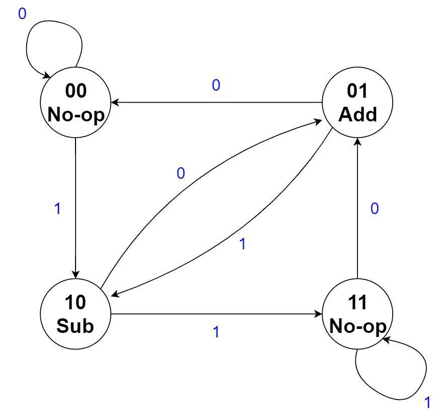
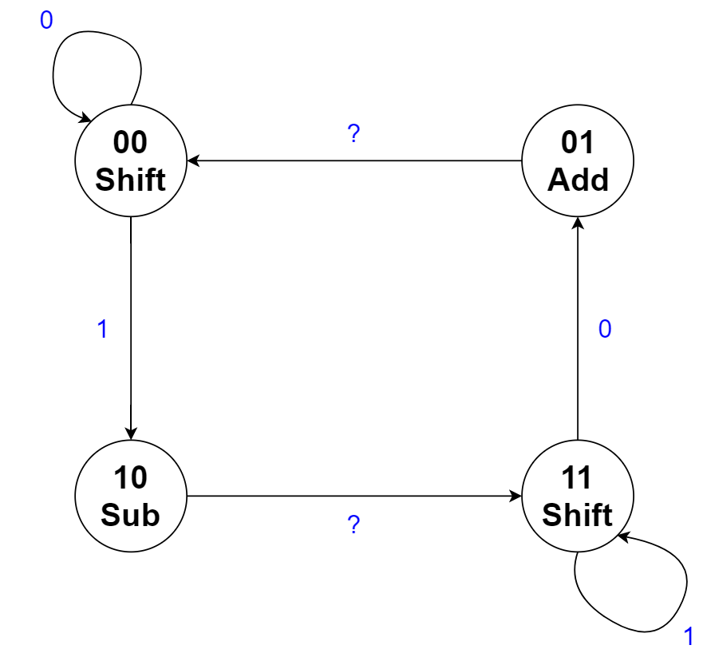

# Moore Implementation of Booth's Controller
{: .no_toc}

## Contents
{: .no_toc .text-delta}

1. TOC
{:toc}

---

## Mealy Implementation

Luckily, moving to the Moore implementation does not deviate significantly from the process of creating the Mealy machine.
Similar to the Mealy representation, we start with a 4-state Moore machine based on the original Booth's algorithm.

### Figure 2.2

{: .text-delta}
Four state Moore FSM for Booth's Multiplication

Now, the outputs are associated solely with the current state, rather than both the current state and the inputs.
Unfortunately, this means that no state minimization can be performed since the only two states with the same outputs are states 00 and 11, which clearly do not have equivalent transitions.

An important difference between this Moore machine and the Mealy machine in [Figure 2.1](https://cse140l.github.io/fa24-labs/docs/lab5/part2/mealy#figure-2.1) is where the input comes from.
In the Mealy machine, it came from the least significant bit of the multiplier, which is inside the 2-bit window that is examined by the traditional Booth's algorithm.
This was not a problem because the output was in part determined by that input.
However, in the Moore machine, the input cannot affect the output, but only which transition to take to the next state.
If the two-bit window contains 01, for example, then the current operation should be an Add operation and the FSM should be in the 01 state.
Thus, the input to the Moore FSM will be the next bit that *will* be shifted into the two-bit window (rather than the bit that was *already* shifted in for the Mealy FSM).
More concretely, the input to this FSM is the *second* least significant bit of the multiplier. 

Employing a similar strategy as we did for the Mealy machine, we can have the no-op output instead be a 'shift' output, and have the FSM make a transition based on the clock.
However, we still need to somehow ensure a shift occurs after every add or subtract operation.
This naturally worked out nicely with the Mealy FSM, but closer inspection of the Moore FSM reveals that we are not quite so lucky.
For example, if we are in state 00 and the next bit to be shifted in is a 1, then we will shift in the 1 and make a transition to state 10.
The next input could be either a 1 or a 0.
Depending on the input, this results in two scenarios: 

1. If it is a 1, then we transition next to the 11 state (after performing the subtraction), and since no shift occurred, the input is still 1. We then perform a shift and transition to the same state. In this case, everything works out perfectly, as it did with the Mealy FSM. 

2. If it is a 0, then we next transition to state 01. So, immediately following the subtraction operation is an addition (that, in the absence of a shift, will cancel the two operations out). Since no shift has occurred yet, the input is still 0 and we transition to the 00 state, where we finally get a shift. So, the machine has effectively 'skipped' a non-zero bit in the multiplier, and the partial product is now incorrect. 

In conclusion, the first scenario works out, but in the second scenario, we still need a shift to occur between the subtract and the add.
You may notice, however, that although the 10 and 11 states are not equivalent because the outputs are nonequivalent, the transitions are equivalent.
If we 'force' the FSM to transition from 10 to 11 (after the subtraction), then we will guarantee that a shift will take place.
And, since the transitions are equivalent, we will end up going to the correct state on the next cycle anyway! Thus, we can simply remove the transition from state 10 to 01, and have the FSM transition from 10 to 11 regardless of the input.
We will do something similar for the transitions from the 01 state.
Then, everything will work out correctly, and we will still be able to skip unnecessary operations! The following is the new, updated Moore state machine, where a '?' indicates a 'don't care' input:

### Figure 2.3

{: .text-delta}
The modified four state Moore FSM for Booth's Multiplication

Similar to the Mealy machine, we just need to add an additional `INIT` and `END` state.
The 00 and 11 states can transition to the `END` state, governed by a counter that counts the number of shifts that have occurred.
However, there is one more hurdle with the Moore implementation that needs to be handled.
The `INIT` state must transition to either the 00 or the 10 state, depending on the least significant bit of the multiplier.
Thus, the LSB of the multiplier must also be an input to the Moore FSM, used only to determine the transition from the `INIT` state.

## Implementation Details

Please create an embedded circuit named `MooreController.dig` that you will use when making `BoothsMultiplierMoore.dig`.

If we consider the 4 states required as shown in [Figure 2.3](#figure-2.3), as well as the additional 2 states for `INIT` and `END`, then we will need 3 flip-flops to store the current state.
Additionally, we will have a 1-bit input for the next bit to be shifted into the 2-bit window examined by Booth's, a 1-bit input to signify when we have completed $N$ shifts, and a 1-bit input to signify whether the init state should transition to state 00 or 10, for a total of 3 bits of inputs.
This will result in a 6-variable K-map, which would be a nightmare to use!
Instead, for simplicity, you may ignore the init and end states, as well as the input that signifies which state to transition to after the init state, when deriving your next state logic and output logic.
Then, after adding in the init and end states, you may use any encoding of your choice.
This should be rather easy, as the input we ignored is only used once by the init state, and the logic to transition to the end state should be fairly separable and straightforward.
Your Moore implementation of the new controller will have the same outputs as in the Mealy Machine. 
The inputs are summarized as: 

| Port Direction | Port Name       | Active | Port Width (bits) | Description                                                             |
|:--------------:|-----------------|:------:|------------------:|-------------------------------------------------------------------------|
|      INPUT     | `CLK`           | Rising |                 1 | Clock input used for the circuit                        |
|      INPUT     | `RST`           |  High  |                 1 | Synchronous reset.                       |
|      INPUT     | `SHIFT_IN`      |    -   |                 1 | The next bit to be shifted into the 2-bit window examined by Booth's algorithm (i.e. the second to least significant bit of the Multiplier register). |
|      INPUT     | `CURRENT_SHIFT` |    -   |                 1 | If logic 1, then the init state should transition to the '10' state. If logic 0, then the init state should transition to the '00' state. This input should be driven by the LSB of the multiplier register. |
|      INPUT     | `COMPLETED`     |    -   |                 1 | A logic 1 on this input means $N$ shifts have occurred, and a transition to the `END` state should occur next. Else, the input should be a logic 0. This input is driven by a counter (and a few extra gates). |
|     OUTPUT     | `EX_OP`         |    -   |                 2 | 2-bit output according to [Table 2.1](https://cse140l.github.io/fa24-labs/docs/lab5/part2/mealy#table-2.1). |
|     OUTPUT     | `DONE`          |  High  |                 1 | Set high when you have finished the multiplication                      |
|     OUTPUT     | `INIT`          |  High  |                 1 | Set high at start of multiplication                      |

Again, the `CLK` and `RST` inputs are not used when deriving your next state and output logic.
Additionally, the `CURRENT_SHIFT` input can be ignored when deriving your logic for simplicity.
As with the Mealy version, please use the **minimum-bit-change heuristic** when determining the 4 state encodings.
Please implement the controller using `RS-Flip-Flop, clocked` component in *Digital*.
For encoding of the `INIT` and `END` states, you may encode and implement them in any manner you wish.

We ask you to use this controller integrated into your Lab 2 Booth's multiplier, as you did for the Mealy machine.
As the outputs match the Mealy controller, you will find that changing the Mealy controller to the Moore controller will be rather straightforward.
